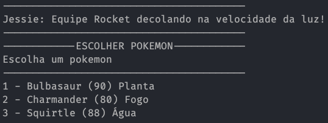
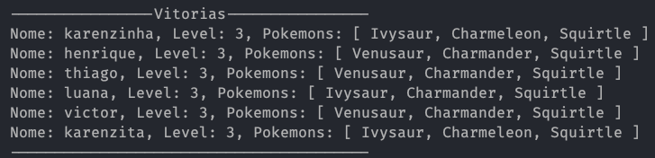
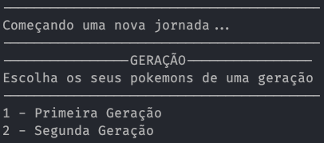
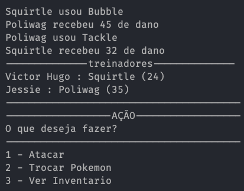
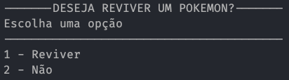
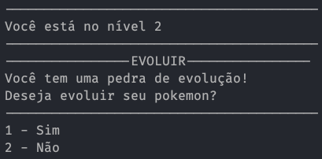
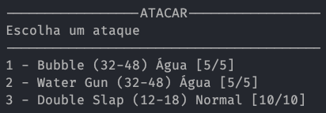

# Pokemon Battle in Java Terminal



## Description

This is a Pokemon Battle game in Java Terminal. It was made for a test in Santander Coders. The game is in portuguese. The game is a turn-based battle between two pokemons. And this object is to arrive at the level 3.

## How to run

1. Clone the repository
2. Open the project in your IDE
3. Run the Main.java file
4. Enjoy the game

# Game Rules

## History

Is possible to see the history of games winned, lost and aborted. The history is saved in a text file.

History is a table with the following columns: Name, Level and Pokemons.



## Generation

When you start a new game, can choose between 2 generations of pokemons. Each generation you get 3 pokemons and confront 3 trainers.



## Battle

The battle is a turn-based battle between two pokemons. The pokemons have 4 attacks and a life bar. If the life bar is 0, the pokemon is dead. The battle ends when all pokemons are dead.



## Itens

### Revive Potion

To revive potion is used to heal your pokemon. It can be used only once per battle. If your pokemon die, contains a potion that can be used to heal your pokemon. If you win the battle restore your revive potion.



### Evolution Stone

The evolution stone can be used to evolve your pokemon. If the enemy pokemon die, you win the battle and get a evolution stone.

**Example**: Charmander -> Charmeleon -> Charizard



## Attacks




### Damage

The damage is calculated with the following formula:

```
Base = random.nextInt(max - min) + min

Damage = Base * Multiplier
```

Where:

* **Base**: is a random number between the min and max value of the attack
* **Multiplier**: is the multiplier of the attack type (weakness, resistance or normal)
* **Damage**: is the damage that the attack will do

### Type

Each type has a weakness and a resistance. The weakness is the type that the attack does double damage. The resistance is the type that the attack does half damage.

The attacks have a type that can be: Normal, Fire, Water, Grass, Electric, Ice, Fighting, Poison, Ground, Flying, Psychic, Bug, Rock, Ghost, Dragon, Dark, Steel, Fairy.

**Example**: A fire attack does double damage to a grass pokemon and half damage to a water pokemon.

### PP (Power Points)

The attacks have a PP (Power Points) that is decremented every time the attack is used and if the PP is 0, the attack is disabled. This system is used to balance the game.
